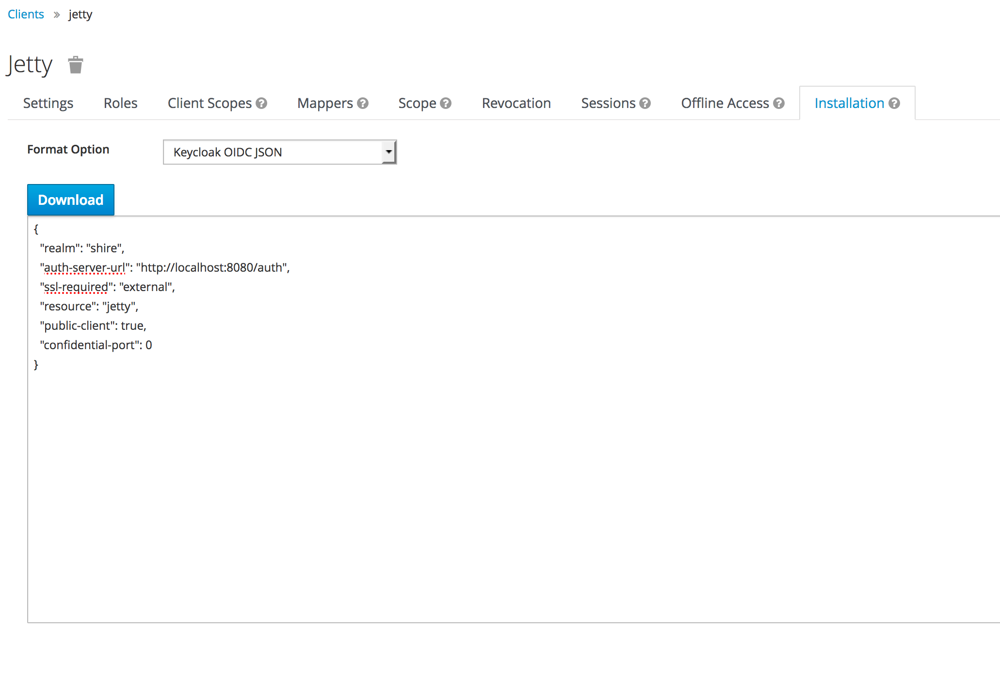
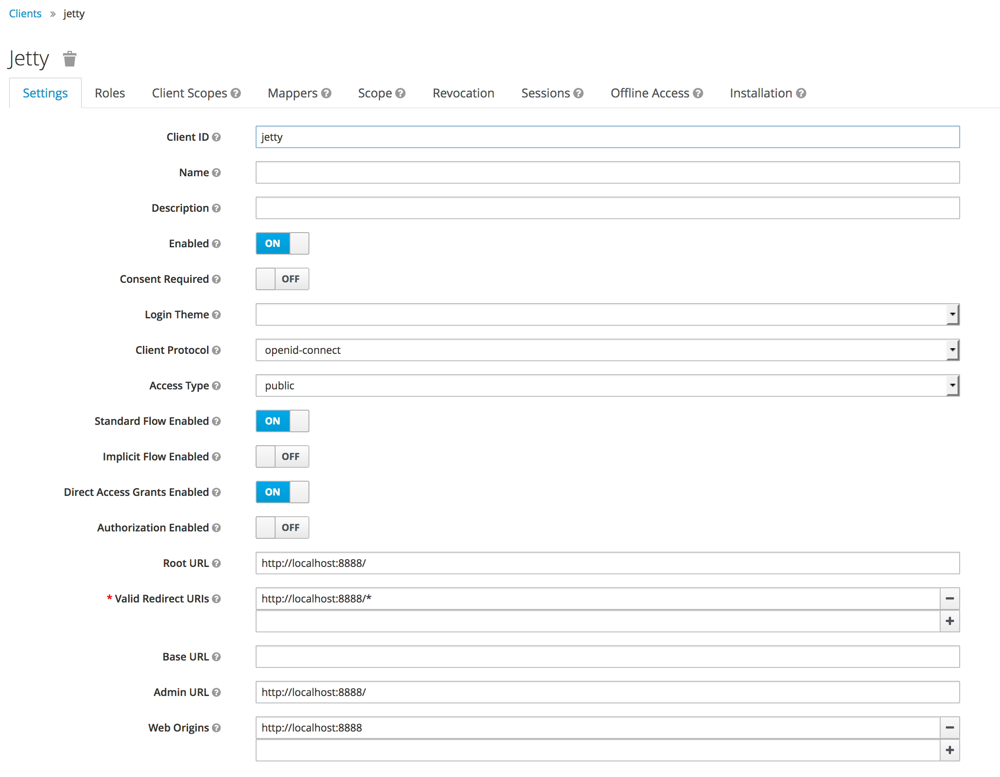

# Keycloak Spring MVC/Spring Security

This project demonstrates how to convert an [Vanilla Spring MVC/Spring security](../vanilla-spring-security) webapp to one authenticated with KeyCloak. 

## Assumption

* KeyCloak runs on port 8080
* KeyCloak admin username and password is admin/admin. 
* A user other than admin is created and his password is set

## New dependencies added to pom.xml

     <dependency>
         <groupId>org.keycloak</groupId>
         <artifactId>keycloak-spring-security-adapter</artifactId>
         <version>${keycloak.version}</version>
     </dependency>
		
     <dependency>
         <groupId>org.keycloak</groupId>
         <artifactId>keycloak-admin-client</artifactId>
         <version>${keycloak.version}</version>
     </dependency>
        
     <dependency>
         <groupId>org.jboss.resteasy</groupId>
         <artifactId>resteasy-jaxrs</artifactId>
         <version>${resteasy.version}</version>
     </dependency>
		
     <dependency>
         <groupId>org.jboss.resteasy</groupId>
         <artifactId>resteasy-client</artifactId>
         <version>${resteasy.version}</version>
     </dependency>
        
     <dependency>
         <groupId>org.jboss.resteasy</groupId>
         <artifactId>resteasy-jackson2-provider</artifactId>
         <version>${resteasy.version}</version>
     </dependency>

## Other changes

* KeycloakAuthenticationProvider2.java
* keycloak-spring-security.xml
* keycloak-local.json, see below for details

## Deploy

### Start the server
     
     mvn -Djetty.port=8888 -Denv=local jetty:run
     
### Admin page

     http://localhost:8888/admin
     
### Welcome page
 
     http://localhost:8888/welcome
     
The contents of keycloak-local.json are copied from the KeyCloak admin screen.
 
Clients -> Click <Client id> -> Installation -> Format option, choose 'KeyCloak OIDC JSON'
     

     
Refer to [KeyCloak documentation](https://www.keycloak.org/docs/latest/authorization_services/index.html#_resource_server_create_client) for how to create a client. 

Client settings in this example are as below



The class ```KeycloakAuthenticationProvider2``` shows how to retrieve the roles and groups for the user. To retrieve the groups of the user, you need to make use of the KeyCloak Admin API. Specifically, create a ```KeyCloak``` instance with the admin username and password, then you can get the realm, user, and groups information. 

## Reference:

https://www.baeldung.com/spring-boot-keycloak
